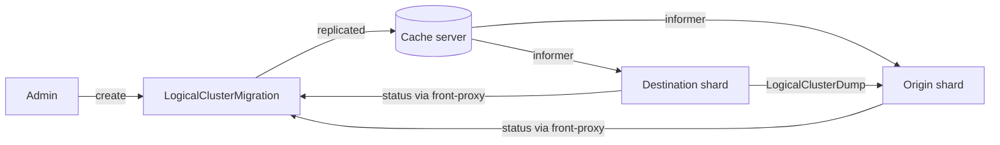

# Logical Cluster Migrations

What, Why and How

Nelo-T. Wallus, SAP SE

kcpCon 2026

---
layout: section
---

# Why

---

# Uscases

- Single shard to multi shard
- Decommissioning a shard, hardware or region changes
- Isolating a noisy tenant

---

# Problems without migrations

- Shards grow over time
  - Workspaces grow in size
  - Additional workspaces get scheduled
  - Traffic may vary wildly depending on the tenant
- Shards are constrained by the etcd backing them
- Shards are constrained by hardware
- New shards only help to schedule new workspaces

---

# Scale the shards

- More resources for shards
- More resources for etcd

---

# Scale the shards

- More resources for shards
- More resources for etcd

## Contra

- Still bounded by etcd limits

---

# Cordon shards

- Stop allocating new workspaces

---

# Cordon shards

- Stop allocating new workspaces

## Contra

- Busy tenants still disrupt each other
- Still bounded by etcd limits

---

# Copy through the API

- List available APIs
  - for each API enumerate every object
  - get and apply
- Backup/restore tools like Velero

---

# Copy through the API

- List available APIs
  - for each API enumerate every object
  - get and apply
- Backup/restore tools like Velero

## Contra

- Restores into a new logical cluster
  - references from other workspaces break
  - Existing consumers of APIExports are lost
- New objects on the target
  - new UID, creationTimestamp, managedFields
  - status and ownerReference UIDs lost
  - admission runs again

---

# Copy through the API

- List available APIs
  - for each API enumerate every object
  - get and apply
- Backup/restore tools like Velero

## Pro

- Simple to implement
- Uses existing tooling

---

# Copy raw etcd data

- copy every object byte-by-byte from origin to destination shard's etcd

---

# Copy raw etcd data

- copy every object byte-by-byte from origin to destination shard's etcd

## Contra

- etcd operations bypassing the API server

---

# Copy raw etcd data

- copy every object byte-by-byte from origin to destination shard's etcd

## Contra

- etcd operations bypassing the API server

## Pro

- preserves identity
- preserves UIDs, ownerReferences, timestamps, ...
- keeps APIExport/-Bindings working

---
layout: section
---

# How

---

# Goals

- Primitive for platforms
- Logical cluster keeps its identity
- Objects retain their UID
- Unrelated workspaces are not interrupted

---

# Goals

- Primitive for platforms
- Logical cluster keeps its identity
- Objects retain their UID
- Unrelated workspaces are not interrupted
- Transparent to the user and operators

---

# Non-Goals

- Automatic Rebalancing
- Destination selection

---

# API

- Feature gate `LogicalClusterMigration`
- API `migration.kcp.io/v1alpha1`:

```yaml
apiVersion: migration.kcp.io/v1alpha1
kind: LogicalClusterMigration
metadata:
  name: tenant
spec:
  logicalCluster: 2idl9ngkjhlfjddm
  destinationShard: shard-1
```

---

# Coordination

- Shards update the `LogicalClusterMigration` through the front-proxy
- React to changes received via the cache-server
- Data flows directly from origin to destination through the VW



---
layout: center
---

# Demo: First part

---

# Phases


---

# Preparing on Origin


- Hides the logical cluster and blocks requests to it
  - TODO name the annotation
- Cancel its open connections
- Purge it from the shard's informers

Nothing on the origin writes to it anymore.

---

# Migrating on Destination


- Hides the logical cluster and blocks requests to it
- Migrates data
  - Requests `LogicalClusterDump` from Origin VW
  - Paginated
- Record maintained in `LogicalClusterMigration`

---

# OriginCleanup on Origin


- `etcd Delete` per group/resource prefix of the logical cluster

---

# DestinationFinalize on Destination

- Unhides the LC by removing the migrating annotation
- Recreate bound CRDs
- Relist all informers
- Allow requests again

---
layout: center
---

# Demo: Second part

---

# Requests during a migration

- List and Watch with a resource version: `410 Gone`
- Everything else: `503`, `Retry-After: 1`

---

# What moved

- Every etcd key of the logical cluster
- UIDs and creationTimestamps unchanged
- resourceVersions changed
- Workspace annotation `core.kcp.io/shard` updated

<!--
Step 7 prints the comparison of bulk-00000 before and after.
Then the kcpctl commands to show the Workspace and the LogicalClusterMigration.
-->

---

# Drawbacks

- Workspace unavailable for the whole copy
- ~0.5 GiB took 2 to 3 minutes in the demo
- resourceVersions reset, clients relist


---
layout: section
---

# Pitfalls

<!-- 3 min -->

---

# Operations

- Feature gate on all shards and the cache server
- No cancel
- Migrating back to a former origin stalls
- Large objects are expensive on the origin
  - the dump reads 1000 values per etcd request

<!--
Migrating back: cancelled per-cluster context stays in the context manager after OriginCleanup.
Dump: pkg/server/migrationdump scans the whole keyspace with values, #4399.
-->

---

# Data

- Encryption at rest
  - keys, including prefix, must match on all shards
  - destination does not become ready after restart
- etcd leases are dropped
  - Events never expire on the destination
- Same kcp version on all shards
  - objects keep the origin's storage version

<!--
aesgcm with /registry vs /shard-2: "cipher: message authentication failed".
KMS v2 from code reading only.
-->

---
layout: section
---

# Improvements

<!-- 2 min -->

---

# Improvements

- Online migration: copy, replay changes, short cutover
- Verify copied data before `OriginCleanup`
- Dump only the logical cluster's key ranges
- Keep etcd leases
- Not relisting the whole shard per migration

Epic: kcp-dev/kcp#3498

---
layout: center
---

# Questions

github.com/ntnn/kcpcon-2026-10-01-lc-migration
